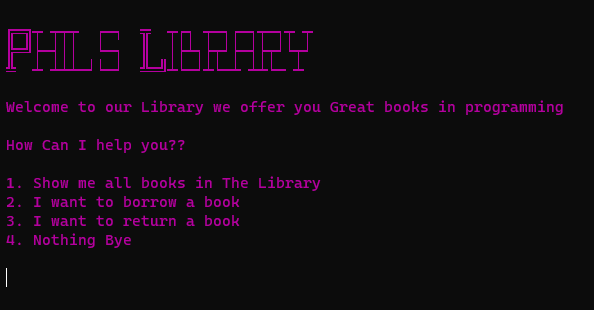
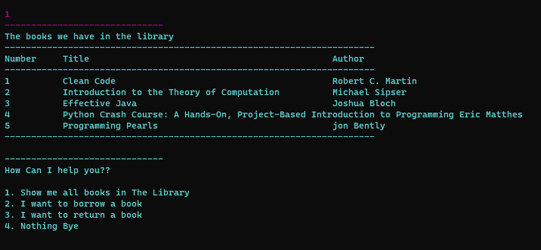
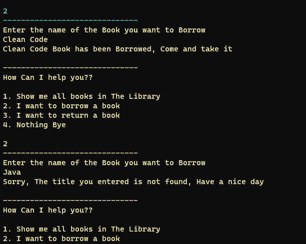
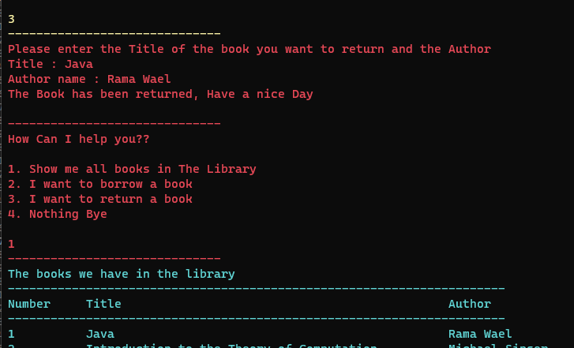
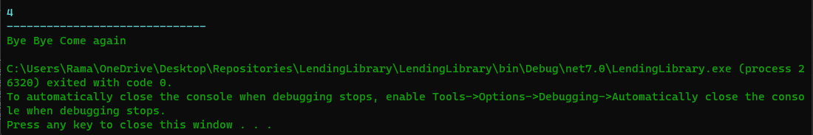
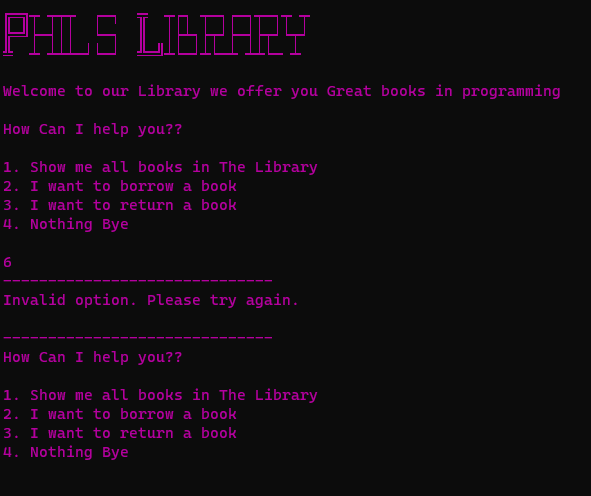

# Phil's Lending Library
+ The Lending Library is a program that simulates a library system, allowing users to View a collection of books, borrow and return books, and keep track of borrowed books using a backpack.

## Summary
### The Lending Library program consists of :

+ Book class: Represents a book with properties like title and author.

+ Library class: Implements the ILibrary interface to manage a collection of books. It allows users to add books to the library, borrow books by title, and return books to the library.

+ Backpack<T> class: Implements the IBag<T> interface , It allows users to pack items into the backpack and unpack items by index.

#
## Visual
### What does our program looks like? 
### First once you run the program you can see this

+ It allows you to choose what you want 
### If you choose the first option this what you will get :    

+ The first option is responsible of showing the user all the books in the library in a Table.

### If you choose the option 2 This will happens :
     
+ It asks the user to enter the title of the book to borrow then it calls the library.Borrow function , You can see in the picture that if you entered a title that not found nothing will happened.
  
### if you choose to return a book You will asked to wnter the title and the author of the book Like this :  

    

### And finally If you Change your mind and you don't want to do anything choose number 4 to exit the program
    

### Also you will get this for the invalid option Like if you entered something else that 1,2,3 or 4      

#
## Usage :
+ I have already explained to you in the visuals how to use the program it's so easy and simple 
+ Choose number to specify what you want 
+ chhoose 1 for see all the books in the library
+ 2 for borrowing a book and don't forget to write an existing title for the book 
+ option 3 for returning a book 
+ And option 4 for getting the Bye Bye 

